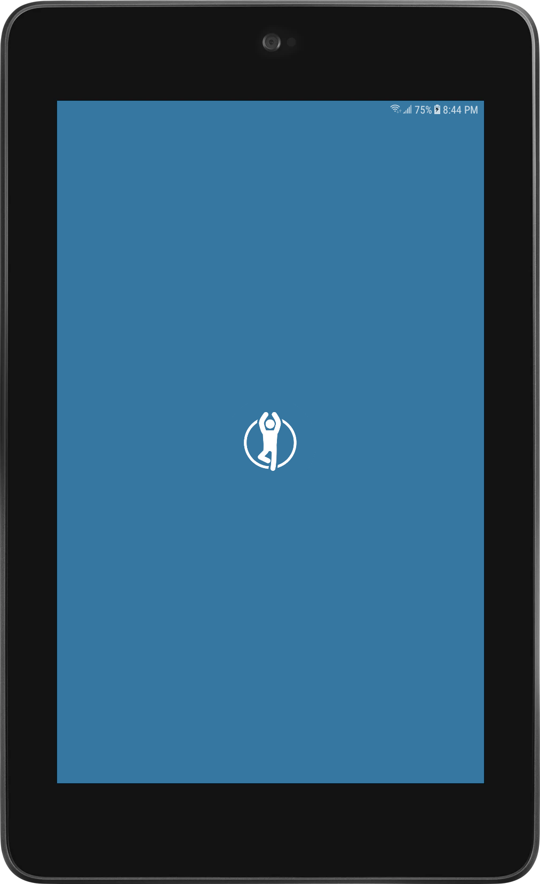
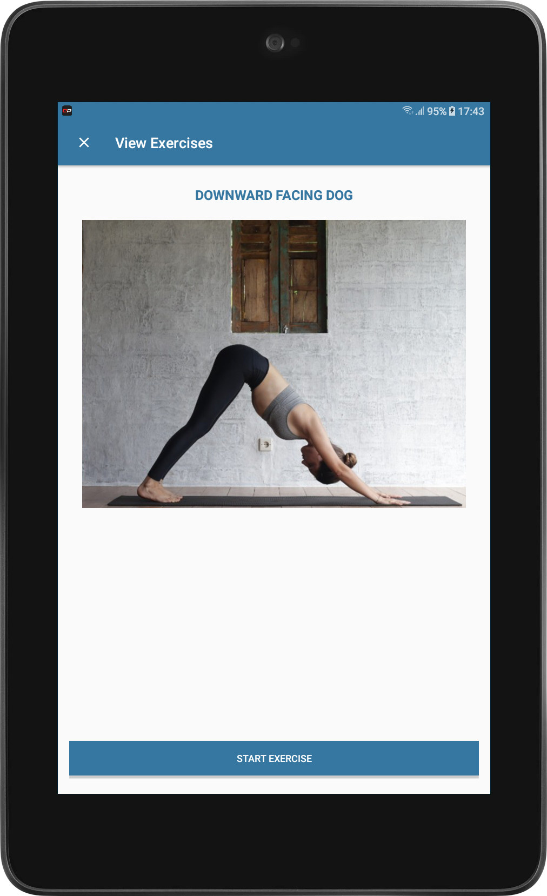
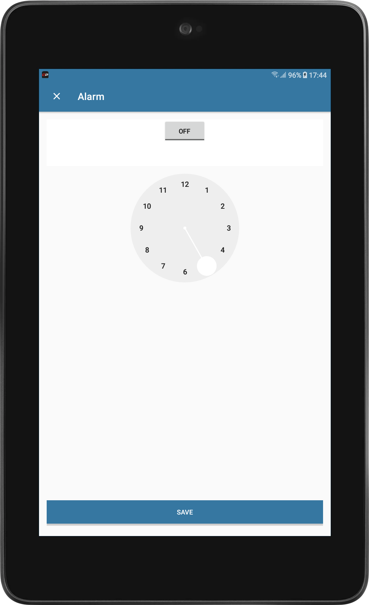

# YogaFitness

Yoga Fitness is an app to measure , record and track your fitness

## Icon

## Features
* View Yoga Fitness Exercises
* Countdown for Training
* Alarm Setting for Fitness Time
* Calendar to view all days we have done training

## Play Store Link
**[Install on Google Play](https://play.google.com/store/apps/details?id=com.anelemhlanga.yogafitness)**

## Art
   

## Technologies
* Java 
* RecyclerView
* CardView 
* SQlite

